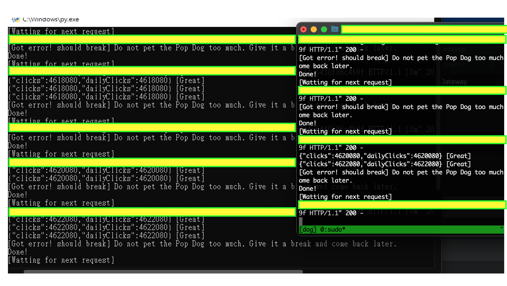

# Request Dog

For popdog.click

## Installation

The program needs flask and requests packages.

## Usage

If you only have one IP. Please follow this code
```python
def dog():
    url = "https://popdog.click/clicked/v2"
    data = {
        "clicks": 2000,
        # change username to your name
        "username": "KaoDuanYeeMeow",
        # change uuid to your uuid
        "uuid": ""
    }
    headers = {
        "Accept": "*/*",
        "Content-Type": "application/json;charset=utf-8",
        "Origin": "https://popdog.click",
        "Accept-Language": "zh-tw",
        "Host": "popdog.click",
        "User-Agent": "WTF",
        "Referer": "https://popdog.click/",
        "Accept-Encoding": "gzip, deflate, br",
        "Connection": "keep-alive",
    }
    while open('config.txt', 'r', encoding='utf-8').read().strip("\n") == "1":
        res = requests.post(url, headers=headers, json=data, verify=False).text
        if "Do not pet the Pop Dog too much" in res:
            print("[Got error! should break]", res)
            time.sleep(5)
        else:
            print(res, "[Great]")
```
If you have  One or more of IPs.
Please follow the request_dog.py
```python
@app.route('/trigger_path', methods=['GET'])
app.run(host="0.0.0.0", port=18116, debug=True)
```
Replace `your server ip or domain` to your different IP
```python
print(requests.get("http://your server ip or domain:18116/trigger_path").text)
```
To statr popdog auto click, paste `http://your server ip or domain:18116/trigger_path` to browser and u will get DONE on your browser content.
For instance.

A Server:
`
IP: xxx.xxx.xxx.xxx
`
Request_dog.py
```python
print(requests.get("http://yyy.yyy.yyy.yyy:18116/trigger_path").text)
```
B Server:
`
IP: yyy.yyy.yyy.yyy
`
Request_dog.py
```python
print(requests.get("http://xxx.xxx.xxx.xxx:18116/trigger_path").text)
```
