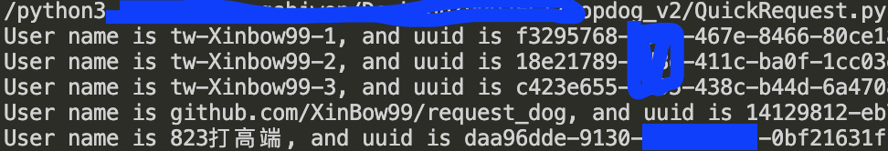
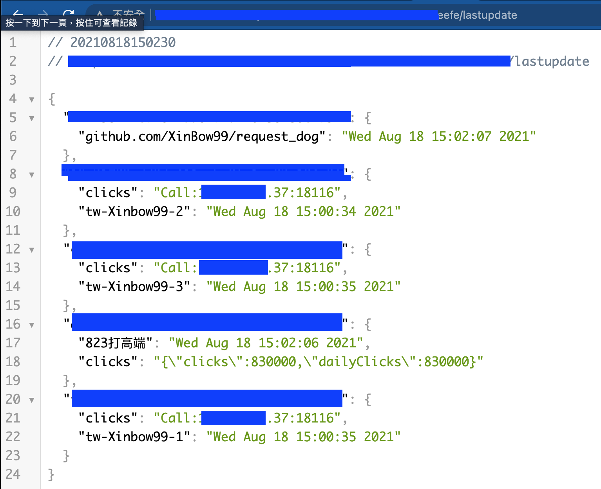

# Request Dog

For popdog.click

## Installation

The program needs flask and requests packages.

## Usage

### If you only have one IP. Please follow this code
```python
def dog():
    url = "https://popdog.click/clicked/v2"
    data = {
        "clicks": 2000,
        # change username to your name
        "username": "KaoDuanYeeMeow",
        # change uuid to your uuid
        "uuid": ""
    }
    headers = {
        "Accept": "*/*",
        "Content-Type": "application/json;charset=utf-8",
        "Origin": "https://popdog.click",
        "Accept-Language": "zh-tw",
        "Host": "popdog.click",
        "User-Agent": "WTF",
        "Referer": "https://popdog.click/",
        "Accept-Encoding": "gzip, deflate, br",
        "Connection": "keep-alive",
    }
    while open('config.txt', 'r', encoding='utf-8').read().strip("\n") == "1":
        res = requests.post(url, headers=headers, json=data, verify=False).text
        if "Do not pet the Pop Dog too much" in res:
            print("[Got error! should break]", res)
            time.sleep(5)
        else:
            print(res, "[Great]")
```
### If you have  One or more of IPs.
Please follow the command
```bash
python3 request_dog.py call_ip trigger_path
```
python3 request_dog.py 192.168.1.3 6d8d324b4a11cf4ed
And you can run `QuickRequest.py` to start your bot
replace trigger_path to custom token path
For instance.
In you have two servers, server A and B.

Server A start command: 
```bash
python3 request_dog.py server_B_IP 6d8d324b4a11cf4ed
```
Server B start command: 
```bash
python3 request_dog.py server_A_IP 6d8d324b4a11cf4ed
```
And you can call `http://ServerA_or_B_Ip:18116/6d8d324b4a11cf4ed/create/bot-name/bot-uuid` and `http://ServerA_or_B_Ip:18116/6d8d324b4a11cf4ed/lastupdate`

Demo.
create:

lastupdate:



