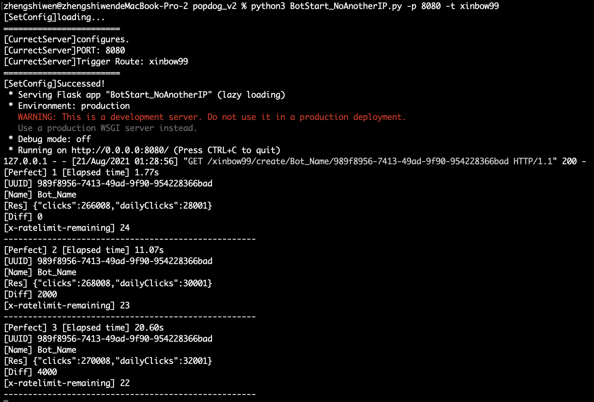
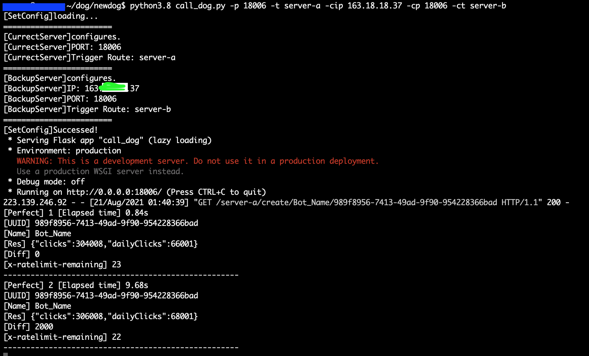

<p align="center">
  <a href="" rel="noopener">
 </a>
</p>
<h3 align="center">POPDOG BOT</h3>

<div align="center">

[]()
[](https://github.com/XinBow99/popdog_bot/issues)
[](https://github.com/XinBow99/popdog_bot/pulls)
[](/LICENSE)

</div>

---

<p align="center"> POPDOG Bot is a Python application for auto request click event of popdog RESTApi.
    <br> 
</p>

---

## 📝 Table of Contents

- [Installation](#Installation)
- [About](#about)
- [Usage](#usage)
  - [Only have an public IP](#OnlyHaveAnPublicIP)
  - [More than the one public ip](#HaveManyPublicIP)

---

## Installation <a name = "Installation"></a>

Make sure your environment have those package.
- flask
- flask_cors
- threading
- requests
- time
- random
- argparse
- sys
- json

and `python version >= 3`

---

## About <a name = "about"></a>
### How to get uuid
Open the Developer Tools on your browser, and switch to `Application` tab.

you can also insert `uuid`

If you want get new uuid, call this route 
```
https://popdog.click/uuid
```
or clear Storage on browser and refresh.

---

## 🏁 Usage <a name = "usage"></a>
### If you `only have an public IP.` <a name="OnlyHaveAnPublicIP"></a>
#### Please run this bash command. 
If you `only have an IP` or you want start on `one server(computer)`.
```bash
$python3 BotStart_NoAnotherIP.py -p 8080 -t trigger
```
- `-p` is Server start port
- `-t` is Server trigger route

Now you can access these routes.

- To create a bot event
  - http://`<ip>`:`<port>`/`<trigger-value>`/create/`<Bot_Name>`/`<Bot_UUID>`

- To visit bot status

  - http://`<ip>`:`<port>`/`<trigger-value>`/lastupdate

#### Success figure of start.


#### Simple demo
It's my command:
```bash
$python3 BotStart_NoAnotherIP.py -p 8080 -t xinbow99
```
Create bot session route
```
http://127.0.0.1:8080/xinbow99/create/Bot_Name/989f8956-7413-49ad-9f90-954228366bad
```

---
### If you have more than the one public ip.<a name="HaveManyPublicIP"></a>
#### Please run this bash command. 
```bash
$python3 BotStart_HaveAnotherIP.py -p 18006 -t test_trigger -cip 172.18.18.18 -cp 18006 -ct test_trigger
```
- `-p` is Server start port
- `-t` is Server trigger route
- `-cip` is Another Server of public ip or domain
- `-cp` is Another Server of running port
- `-ct` is Another Server of running trigger route

Now you can access these routes.

- To create a bot event
  - http://`<ip>`:`<port>`/`<trigger-value>`/create/`<Bot_Name>`/`<Bot_UUID>`

- To visit bot status

  - http://`<ip>`:`<port>`/`<trigger-value>`/lastupdate

#### Success figure of start.


#### Simple demo
It's my command on my server A:
```bash
$python3.8 BotStart_HaveAnotherIP.py -p 18006 -t server-a -cip 163.xx.xx.37 -cp 18006 -ct server-b
```
So, i choise server A be my Main server. Create bot session route
```
http://163.xx.xx.38:18006/server-a/create/Bot_Name/989f8956-7413-49ad-9f90-954228366bad
```

Visit status by `http://163.xx.xx.38:18006/server-a/lastupdate`, you can also do that on you localhost too. When you start `BotStart_NoAnotherIP.py`

When server A got an error, that will call Server B to continue.


It's my command on my server B:
```bash
$python3.8 BotStart_HaveAnotherIP.py -p 18006 -t server-b -cip 163.xx.xx.38 -cp 18006 -ct server-a
```
---


